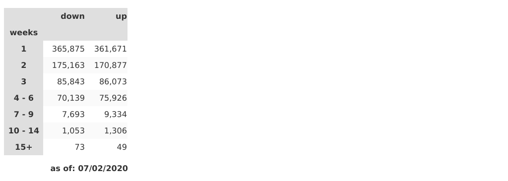

# Streaks

The purpose of this repository is to hold my investigations into "streaks", weekly performance runs for stocks, either upward or downward.

## Introduction

I got interested in this phenomenon, when in early 2020 I noticed by coincidence that AMD stock had gone 14 consecutive weeks. It struck me as just an improbably strong run of performance, and I was curious whether this had ever happened before with AMD, or in fact any other stock.

To explore this phenomenon I downloaded weekly stock performance data from [Tiingo](https://www.tiingo.com), into separate *.csv files ("[CSVs](./CSVs)" folder) for each stock, and then calculated performance streaks from that. Results are captured in "[streaks.csv](./streaks.csv)".

You are free to clone or download the code to support your own analysis.  To rebuild the stock history files (CSVs folder) you will need to access the Tiingo API. The code to download the data is in the [download_csv.py](./download_csv.py) file. To run it, you will need to obtain an access token for Tiingo and provide it in a "config.py" file with the single line

`TT = 'my-secret-tiingo-token'`.

That said, you don't *need* to run any of the supplied code if you are only interested in performing your own analysis of the supplied streaks data. That data set is it is enough to just download [streaks.csv](./streaks.csv).

## Notes on the Data

The data used in this project includes all stocks that are currently constituents of at least one of the following three US stock indices:

- S&P 500
- Nasdaq 100
- Russell 3000

As of 1/28/2020, the total number of stocks in this set is 2.985. Given that 2,975 are currently members of the Russell 3000, it is obvious that the other two indices don't add much more to the mix. That said, I wanted to be sure to include all liquid stocks traded on US exchanges.

The weekly stock performance data reaches back as far as 1970 for some of the stocks. Since I have no stock price information on currently defunct companies, survivorship bias is present in the data. For my specific purposes, that's acceptable, but you should be aware of it.

As of 1/28/2020, there are just over 1.4MM streaks captured in the data, evenly split between "up" (49.92%) and "down" (50.08%) streaks. 

The following charts, created using the [streaks](./streaks.ipynb) Jupyter notebook show some basic statistics for the streaks dataset.

At first glance, the frequency distribution of "up" and "down" streaks does appear quite similar:

That said, the data fails a [Wald-Wolfowitz runs test](./Wald-Wolfowitz.ipynb) at confidence bound `1 - alpha/2` for any reasonable value of `alpha`.  The streaks are, in other words, **not** randomly distributed.

